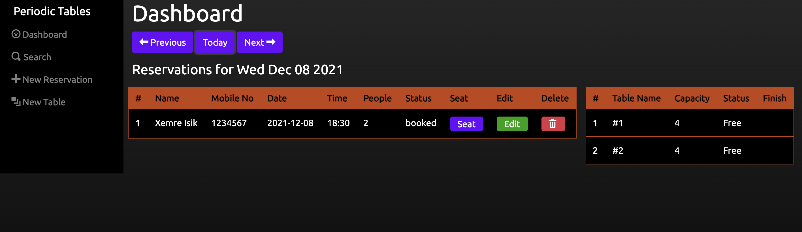
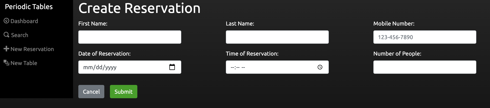
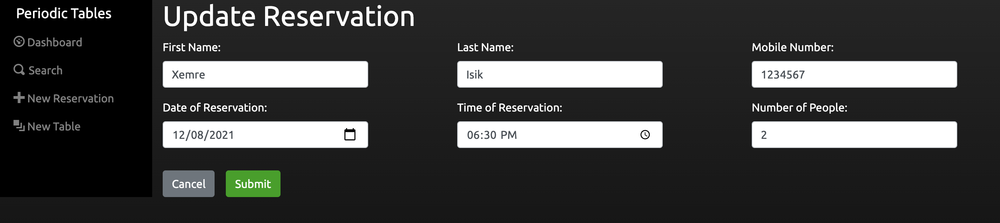
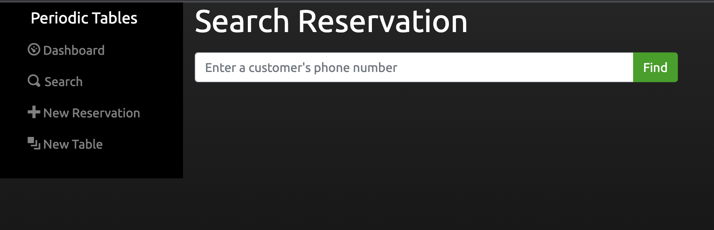
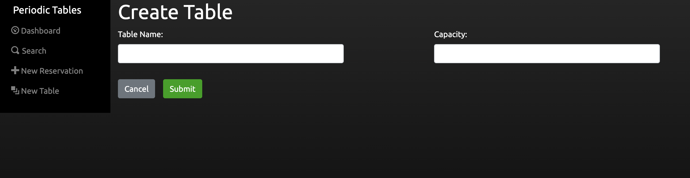

# Periodic Tables - Restaurant Reservation App

### Application link: https://pertab-reservation-app-client.herokuapp.com/dashboard

Restaurant Reservation App is a PERN stack application built for restaurant personnel's use where they can manage all reservations and tables via the app. A user can:
- list all existing reservations and tables
- create a reservation
- edit an existing reservation
- cancel a reservation
- create a table
- seat a reservation to a table
- free up an occupied table
- search reservations by mobile number

> ## Dashboard Page

> ## Create Reservation

> ## Edit Reservation

> ## Search Reservations

> ## Create Table

## Existing API Endpoints

|         API Endpoint     | Description                                                      |
| ------------------------------------ | ---------------------------------------------------------------- |
| `GET`    `/reservations?date={date}`   | Retrieves all reservations on specified date |
| `GET`    `/reservations?mobile_number={mobile_number}`   | Retrieves all reservations matching mobile number |
| `POST`    `/reservations`   | Creates new reservation |
| `GET`    `/reservations/:reservation_id`   | Retrieves reservation specified by id|
| `PUT`    `/reservations/:reservation_id`   | Updates reservation specified by id|
| `PUT`    `/reservations/:reservation_id/status`   | Updates status of reservation specified by id| 
| `GET`    `/tables`   | Retrieves all tables in database |
| `POST`    `/tables`   | Creates new table | 
| `PUT`    `/tables/:table_id/seat`   | Adds reservation_id to table specified by id |
| `DELETE`   `/tables/:table_id/seat`   | Removes reservation_id from table specified by id |

## Technology used
The application was built on PERN stack. On the front-end side, the app was created using React JS library along with Boostrap CSS to style. RESTful APIs were created on Express framework on Node.js. Knex library was used to built the connection between the database and the server.

## Database setup

1. Set up four new ElephantSQL database instances - development, test, preview, and production - by following the instructions in the "PostgreSQL: Creating & Deleting Databases" checkpoint.
1. After setting up your database instances, connect DBeaver to your new database instances by following the instructions in the "PostgreSQL: Installing DBeaver" checkpoint.

### Knex

Run `npx knex` commands from within the `back-end` folder, which is where the `knexfile.js` file is located.

## Installation

1. Fork and clone this repository.
1. Run `cp ./back-end/.env.sample ./back-end/.env`.
1. Update the `./back-end/.env` file with the connection URL's to your ElephantSQL database instance.
1. Run `cp ./front-end/.env.sample ./front-end/.env`.
1. You should not need to make changes to the `./front-end/.env` file unless you want to connect to a backend at a location other than `http://localhost:5000`.
1. Run `npm install` to install project dependencies.
1. Run `npm run start:dev` to start your server in development mode.

If you have trouble getting the server to run, reach out for assistance.
